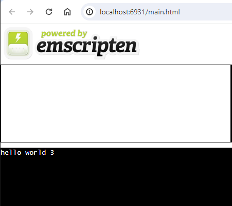
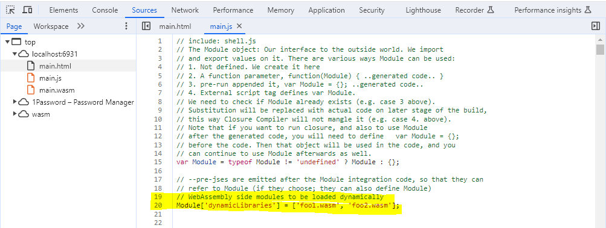

# wasm_dynamic_linking
WebAssembly Dynamic Linking Example using [**Emscripten**.](https://emscripten.org/index.html)

## Background

While the goal is to show how to build a WASM application that links to its WASM modules dynamically at runtime, first we'll show how to statically link the WASM modules to the WASM application at time of build, for comparison purposes.

[Read this slightly outdated article for some background.](https://yushulx.medium.com/webassembly-building-standalone-and-dynamic-linking-modules-in-windows-bd4492d0688f) Then follow on from here for updated methods.

## Main Project Files
1. main.c - WASM application
2. foo1.c - WASM module
3. foo2.c - WASM module
4. pre.js - Contains the list of WASM modules a.k.a. SIDE_MODULEs that need to be preloaded when running the WASM application a.k.a. MAIN_MODULE in a Web Browser

## Build a standalone WASM application containing statically linked WASM modules:

### For running in a WASI Runtime (e.g., **wasmtime**)
```
$emcc main.c foo1.c foo2.c -o main.wasm
```
The generated wasm file doesn’t depend on an Emscripten JS runtime. We can run it in wasi-supporting runtimes, such as **wasmtime**:

```
$wasmtime main.wasm 
hello world 3
```

### For running in a Web Browser (e.g., **Chrome**)
```
$emcc main.c foo1.c foo2.c -o main.html
```
In this case the generated wasm file depends on an Emscripten JS runtime. The the HTML and WASM files need to be served by a local Web Server like **Chrome**:

```
$emrun main.html --browser "/mnt/c/Program Files (x86)/Google/Chrome/Application/"chrome.exe
```
#### Web Browser Output


## Build a WASM application and the WASM modules it needs to link to dynamically at runtime (independantly of each other):

### For running in a WASI Runtime (e.g., **wasmtime**)
```
TODO:
```

### For running in a Web Browser (e.g., **Chrome**)
```
$emcc foo1.c -s SIDE_MODULE=1 -o foo1.wasm
$emcc foo2.c -s SIDE_MODULE=1 -o foo2.wasm
$emcc main.c -s MAIN_MODULE=1 -s ERROR_ON_UNDEFINED_SYMBOLS=0 --pre-js pre.js -o main.html
```
In this case the generated wasm file depends on an Emscripten JS runtime. The the HTML and WASM files need to be served by a local Web Server like **Chrome**:

```
$emrun main.html --browser "/mnt/c/Program Files (x86)/Google/Chrome/Application/"chrome.exe
```

#### Web Browser Output
**Note:**
Web Browser output should be identical to that of the standalone WASM application (shown above), however for it to have worked, the modified main.js source code containing the list of 'dynamicLibraries' to preloaded, must have worked!


