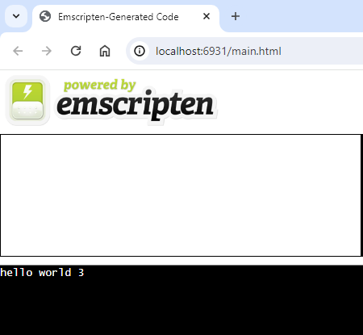

# wasm_dynamic_linking
WebAssembly Dynamic Linking using [**Emscripten**.](https://emscripten.org/index.html)

## Background

While the goal is to show you how to build a WASM application that links to its WASM modules dynamically at runtime, first we'll show how to do it using static linking, so that you can compare it to dynamic linking.

[Read this slightly outdated article for some background.](https://yushulx.medium.com/webassembly-building-standalone-and-dynamic-linking-modules-in-windows-bd4492d0688f) Then follow on from here for updated methods.

## Main Project Files
1. main.c - WASM application
2. foo1.c - WASM module
3. foo2.c - WASM module
4. pre.js - Contains the list of WASM modules a.k.a. SIDE_MODULEs that need to be preloaded when running the WASM application a.k.a. MAIN_MODULE in a Web Browser

## Build a standalone WASM application containg with statically linked WASM modules:

### For running in a WASI Runtime (e.g., **wasmtime**)
```
$emcc main.c foo1.c foo2.c -o main.wasm
```
The generated wasm file doesn’t depend on an Emscripten JS runtime. We can run it in wasi-supporting runtimes, such as **wasmtime**:

```
$wasmtime main.wasm 
hello world 3
```
### For running in a Web Browser (e.g., **Chrome**)
```
$emcc main.c foo1.c foo2.c -o main.html
```
In this case the generated wasm file depends on an Emscripten JS runtime. The the HTML and WASM files need to be served by a local Web Server like **Chrome**:

```
$emrun main.html --browser "/mnt/c/Program Files (x86)/Google/Chrome/Application/"chrome.exe
```

